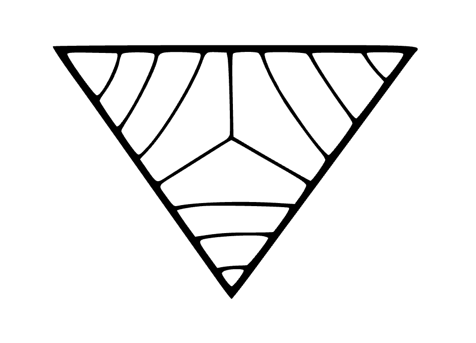

  <picture>
    <source srcset="./assets/ramate-inverted-transparent.png" media="(prefers-color-scheme: dark)">
    
  </picture>

 

> Ramate is the organization with many branches.

<h1>
  <picture>
    <source srcset="./assets/ramate-inverted-transparent.png" media="(prefers-color-scheme: dark)">
    
  </picture>
  Ramate
</h1>

This repository contains artifacts for [Ramate LLC](https://www.ramate.io).

We recommend those new to the organization review the latest [RGUIDE](./rguide/rera-000-000-000-dulan/rguide-000-000-000/README.md).

Our flagship project is [Robles](https://github.com/ramate-io/robles) which is an implementation of [OAC](https://github.com/ramate-io/oac) technologies. Ramate also governs the [OAC](https://github.com/ramate-io/oac) project.

> [!NOTE]
> The organization of this repository is drawn from the organization of the [OAC](https://github.com/ramate-io/oac) repository.

## Contributing

| Task | Description |
|------|-------------|
| [Upcoming Events](https://github.com/ramate-io/oac/issues?q=is%3Aissue%20state%3Aopen%20label%3Apriority%3Ahigh%2Cpriority%3Amedium%20label%3Aevent) | High-priority `event` issues with planned completion dates. |
| [Release Candidates](https://github.com/ramate-io/oac/issues?q=is%3Aissue%20state%3Aopen%20label%3Arelease-candidate) | Feature-complete versions linked to events. |
| [Features & Bugs](https://github.com/ramate-io/oac/issues?q=is%3Aissue%20state%3Aopen%20label%3Afeature%2Cbug%20label%3Apriority%3Aurgent%2Cpriority%3Ahigh) | High-priority `feature` and `bug` issues. |

Please see [CONTRIBUTING.md](CONTRIBUTING.md) file for additional contribution guidelines.

## Organization

### Artifacts
Under [RGLO-0](./rglo/rera-000-000-000-dulan/rglo-000-000-000-artifact/README.md), this subsection defines the recognized artifact types. We recognize the following types:
- [`rera`](./rera): Ramate Eras (RERA) are the periods over which a governing body makes decisions. All other Ramate [Artifacts](./rglo/rera-000-000-000-dulan/rglo-000-000-000-artifact/README.md) are indexed by RERA.
- [`rglo`](./rglo/): Ramate Glosses (RGLO) are defined terms for Ramate.
- [`rproc`](./rproc/): Ramate Proclamations (RPROC) are statements of purpose for Ramate.
- [`rgov`](./rgov/): Ramate Governance (RGOV) are constitutions of, procedures for, and interpretations of Ramate governance.
- [`rleg`](./rleg/): Ramate Legal Documents (RLEG) are published legal documents covering Ramate operations in any jurisdiction.
- [`rcert`](./rcert/): Ramate Certificates (RCERT) certify a given project as abiding by the OAC paradigm.
- [`rde`](./rde/): Ramate Desiderata (RDE) describe wants, open problems, and similar within the Ramate paradigm.
- [`rspec`](./rspec): Ramate Specifications (RSPEC) describe specifications and are typically written in response to RDE. Generally, contributors should use RSPEC to justify non-trivial changes to this repository.
- [`rart`](./rart/): Ramate Articles (RART) are academic papers and similar content which are designated as key to Ramate pursuits. In comparison to OAC, these articles are less focused and included as a sort of "mood wall" for contributors and members of the organization.
- [`rroad`](./rroad/): Ramate Roadmaps (RROAD) are roadmaps describing the intents and objectives of Ramate as an organization.
- [`rlog`](./rlog/): Ramate Logs (RLOG) are periodically submitted logs describing various developments within the Ramate organization.
- [`rguide`](./rguide/): Ramate Guides (RGUIDE) are guides or summaries of Ramate.
- [`rpre`](./rpre/): Ramate Presentations (RPRE) are presentations about Ramate.
- [`rdemo`](./rdemo/): Ramate Demonstrations (RDEMO) are selected demonstrations of Ramate technologies.

<!--RAMATE FOOTER: DO NOT REMOVE THIS LINE-->
---

  <a href="https://github.com/ramate-io/oac">
    <picture>
      <source srcset="/assets/ramate-inverted-transparent.png" media="(prefers-color-scheme: dark)">
      
    </picture>
  </a>
   
  
    <b>Ramate</b>
     
    &copy; 2025 <a href="https://github.com/ramate-io/ramate">ramate-io/ramate</a>
     
    <a href="https://github.com/ramate-io/ramate/blob/main/LICENSE">MIT License</a>
     
    <a href="https://www.ramate.io">ramate.io</a>
  

