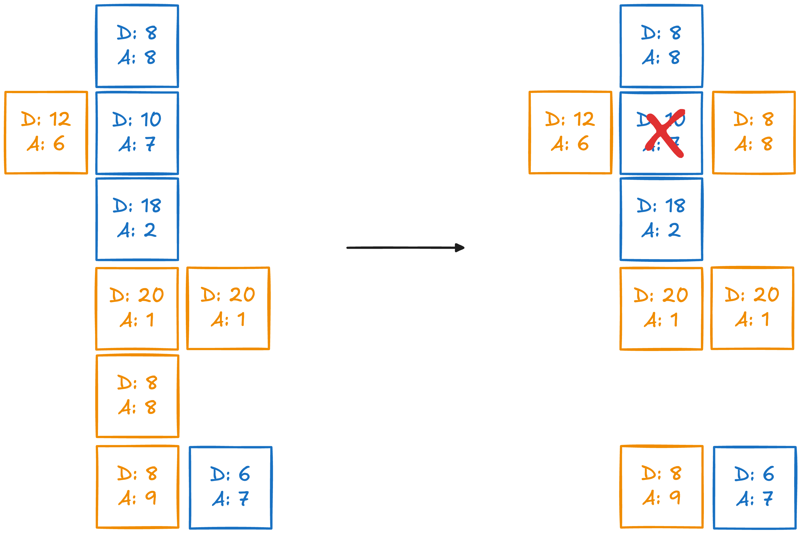

# RLOG-n
- **Authors:** [Liam Monninger](mailto:liam@ramate.io)

## Summary
I discuss some different mechanisms which might suit a decolonial-themed, turn-based game.

## Log

### Ladoka

> [!NOTE]
> This is an old concept of mine that I've never really capped off.

**Gameplay:**

- Character cards. Have unique attack, defense, and movement characteristics.
- Board is a cross between dominoes and chess.
- **Main mechanism** is to place enough of your cards adjacent to one of your opponent's, such that you "overwhelm it," i.e., you attack exceeds its defense.
- Lots to figure out on movement and ensuring right level of complexity.
- **Win** when your opponent can no longer overwhelm any of your cards.

**Decolonial Themes:**

- Make the characters representative of spiritual entities. Gameplay becomes about overwhelming intrusive spirits.

> [!IMPORTANT]
> How do we not anger the spirits while doing this.

- Pivot from character cards and turn it into a game about reshaping narrative (IDK how).

- Make characters important revolutionary figures.

> [!IMPORTANT]
> What does it mean for them to be opponents?

### Leave It

**Gameplay:**

- Catan-like board of contiguous polygons.
- You can your opponent's pieces are spread over the board.
- **Objective** is to remove all your pieces from the board. Perhaps by moving to the edge.
- Draw a card each turn. Card lends an ability--maybe to move a piece, maybe to do something more special.
- Card ability is wrapped up in some lore. Perhaps sometimes you need to remember lore to use the card; we can use a timer to enforce this.

**Decolonial Themes:**

- You're leaving this land.
- Can skew more towards storytelling more towards strategy. Storytelling can be very rich with local detail.
- As you leave, you learn.

> [!IMPORTANT]
> Does an act of undermining your opponents ruin the metaphor? How can we have rivalry while keeping the theme?

<!--RAMATE FOOTER: DO NOT REMOVE THIS LINE-->
---

  <a href="https://github.com/ramate-io/oac">
    <picture>
      <source srcset="/assets/ramate-inverted-transparent.png" media="(prefers-color-scheme: dark)">
      
    </picture>
  </a>
   
  
    <b>Ramate</b>
     
    &copy; 2025 <a href="https://github.com/ramate-io/ramate">ramate-io/ramate</a>
     
    <a href="https://github.com/ramate-io/ramate/blob/main/LICENSE">MIT License</a>
     
    <a href="https://www.ramate.io">ramate.io</a>
  

